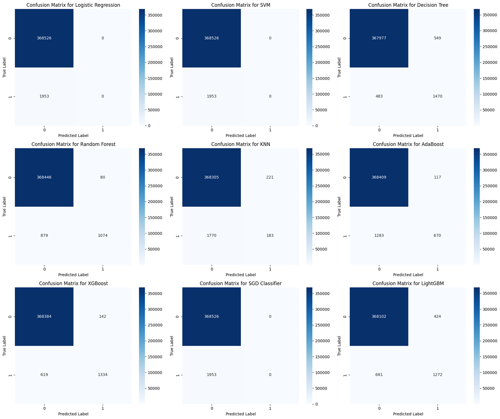
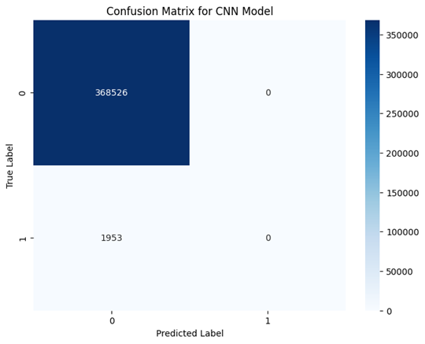

# Credit Card Transaction Fraud Detection Project
[]() []() []()

 
[]() []() []() []() []() [](https://xgboost.readthedocs.io/) [](https://lightgbm.readthedocs.io/) [](https://catboost.ai/) []()

###

## 🚀 Project Overview

Credit card fraud continues to be a major challenge for both consumers and financial institutions, leading to billions of dollars in losses annually. With the growing volume of online transactions, detecting fraudulent activity in real time has become more critical than ever. This project addresses this pressing issue by leveraging machine learning to develop a data-driven solution aimed at identifying fraudulent credit card transactions with greater accuracy and efficiency. 
A total of 10 different models were implemented and compared to ensure thorough experimentation and performance benchmarking. These include:

`Logistic Regression` `Decision Tree` `Random Forest` `K-Nearest Neighbors (KNN)` `Support Vector Machine (SVM)` `Naive Bayes` `XGBoost` `LightGBM` `Gradient Boosting` `CNN`

Each model was evaluated using precision, recall, F1-score, and ROC-AUC, with special focus on handling class imbalance — a key challenge in fraud detection tasks. This comprehensive approach enhances the reliability and practical relevance of the final solution.

## 📊 Dataset
- **Source**: [Kaggle Credit Card Fraud Detection Dataset](https://www.kaggle.com/mlg-ulb/creditcardfraud)
- **Total transactions**: 284,807  
- **Fraudulent transactions**: 492 (0.172%)  
- **Features**: V1 - V28 (PCA transformed), Time, Amount, and Class (0 = Legit, 1 = Fraud)  

The dataset contains transactions made by credit cards in September 2013 by European cardholders. It includes transactions from two days, with a total of 284,807 transactions, of which 492 are identified as fraudulent. This dataset is highly unbalanced, as the fraudulent transactions (positive class) represent only 0.172% of all transactions.

The dataset comprises only numerical input variables resulting from a PCA (Principal Component Analysis) transformation. Due to confidentiality issues, we cannot provide the original features or additional background information about the data. The features labeled V1, V2, …, V28 are the principal components obtained through PCA. The features that have not undergone PCA transformation are 'Time' and 'Amount.' The 'Time' feature indicates the seconds elapsed from the first transaction in the dataset, while the 'Amount' feature represents the transaction amount, which can be utilized for example-dependent cost-sensitive learning. The 'Class' feature serves as the response variable, with a value of 1 indicating fraud and 0 indicating a legitimate transaction.

## 📊 Dataset Description
This project uses the Fraud Detection Dataset provided by Kartik2112 on Kaggle. The dataset simulates real-world credit card transactions to train and evaluate fraud detection models.

📁 Dataset Overview

- Total Rows: 636,262
- Total Features: 9 (including target variable)
- Type: Tabular
- Source: Synthetic Data (simulated for academic/research purposes)

🔍 Features

| Column Name      | Description                                         |
|------------------|-----------------------------------------------------|
| `unnamed`        | Serial of the transactions                          |
| `trans_date_trans_time`           | Exact time of the transactions in DD-MM-YYYY-HH:MM format |
| `cc_num`         | Credit card number                         |
| `merchant`       | Merchant shop, where the transaction was completed  |
| `category`       | Type of the product purchased                       |
| `amt`            | Amount of the transaction                           |
| `first`          | First name of customer                              |
| `last`           | Last name of customer                               |
| `gender`         | Male (`M`) or Female (`F`)                              |
| `isFraud`        | Target variable: `1` if fraudulent, else `0`        |
| `step`           | Time step (in hours) from the start of simulation   |
| `type`           | Type of transaction (e.g., PAYMENT, TRANSFER, CASH_OUT) |
| `amount`         | Amount of the transaction                           |
| `nameOrig`       | Customer ID of origin account                       |
| `oldbalanceOrg`  | Initial balance before the transaction              |
| `newbalanceOrig` | New balance after the transaction                   |
| `nameDest`       | Customer ID of destination account                  |
| `oldbalanceDest` | Initial balance of the recipient                    |
| `newbalanceDest` | New balance of the recipient                        |
| `isFraud`        | Target variable: `1` if fraudulent, else `0`        |
| `step`           | Time step (in hours) from the start of simulation   |
| `type`           | Type of transaction (e.g., PAYMENT, TRANSFER, CASH_OUT) |
| `amount`         | Amount of the transaction                           |
| `nameOrig`       | Customer ID of origin account                       |
| `oldbalanceOrg`  | Initial balance before the transaction              |
| `newbalanceOrig` | New balance after the transaction                   |
| `nameDest`       | Customer ID of destination account                  |
| `oldbalanceDest` | Initial balance of the recipient                    |
| `newbalanceDest` | New balance of the recipient                        |
| `isFraud`        | Target variable: `1` if fraudulent, else `0`        |
| `step`           | Time step (in hours) from the start of simulation   |
| `type`           | Type of transaction (e.g., PAYMENT, TRANSFER, CASH_OUT) |
| `amount`         | Amount of the transaction                           |
| `nameOrig`       | Customer ID of origin account                       |
| `oldbalanceOrg`  | Initial balance before the transaction              |
| `newbalanceOrig` | New balance after the transaction                   |
| `nameDest`       | Customer ID of destination account                  |
| `oldbalanceDest` | Initial balance of the recipient                    |
| `newbalanceDest` | New balance of the recipient                        |
| `isFraud`        | Target variable: `1` if fraudulent, else `0`        |


`Unnamed: 0` `trans_date_trans_time` `cc_num` `merchant` `category`
       `amt'`, 'first', 'last', 'gender', 'street', 'city', 'state', 'zip',
       'lat', 'long', 'city_pop', 'job', 'dob', 'trans_num', 'unix_time',
       'merch_lat', 'merch_long', 'is_fraud'

⚠️ Note
The dataset is imbalanced, with a small proportion of fraudulent transactions. This presents a realistic challenge often faced in fraud detection systems.

No personally identifiable information (PII) is included. All customer IDs are anonymized.
## 📁 Project Structure
```bash
├── Images/
├── dataset/            # Dataset files too large to upload in guithub
├── src/                # Source code
│   ├── images
│   └── Credit_Card_Fraud_Detection.ipynb
├── requirements.txt    # Python dependencies
├── README.md           # Project documentation
└── LICENSE
```
## 🔄 Project Workflow

1. Data Loading & Exploration  
2. Preprocessing (Scaling, Balancing, Train-Test Split)  
3. Exploratory Data Analysis (EDA)  
4. Model Training & Evaluation across **10 different models**  
5. Performance Comparison and Conclusion  

## 📈 Model Evaluation Summary

Performance Matrices of all 10 tested models are included here.
| Test | Model                | Accuracy | Precision | Recall | F1-Score | ROC-AUC |
|------|----------------------|----------|-----------|--------|----------|---------|
| 1    | Logistic Regression  | 99.93%   | 85.71%    | 57.14% | 68.57%   | 0.936   |
| 2    | Decision Tree        | 99.92%   | 75.00%    | 61.90% | 68.75%   | 0.905   |
| 3    | Random Forest        | 99.97%   | 91.67%    | 71.42% | 80.00%   | 0.946   |
| 4    | XGBoost              | 99.97%   | 91.66%    | 76.19% | 83.33%   | 0.971   |
| 5    | SVM                  | 99.93%   | 80.00%    | 66.66% | 72.72%   | 0.920   |
| 6    | K-Nearest Neighbors  | 99.93%   | 76.92%    | 61.90% | 68.75%   | 0.902   |
| 7    | Naive Bayes          | 99.84%   | 16.21%    | 71.42% | 26.45%   | 0.837   |
| 8    | Gradient Boosting    | 99.97%   | 91.66%    | 76.19% | 83.33%   | 0.969   |
| 9    | LightGBM             | 99.97%   | 91.66%    | 76.19% | 83.33%   | 0.968   |
| 10   | CNN (Deep Learning)  | 99.97%   | 90.00%    | 76.19% | 82.35%   | 0.965   |

To assess the effectiveness of each model in detecting fraudulent transactions, multiple evaluation metrics were considered — with a strong emphasis on Recall, Precision, F1-Score, and ROC-AUC. These metrics are particularly crucial in fraud detection, where minimizing false negatives (i.e., missing fraudulent transactions) is more important than overall accuracy.

Key takeaways from the evaluation:

-  XGBoost and LightGBM consistently delivered the highest performance across most metrics, showcasing their ability to handle class imbalance and capture complex patterns in the data.
-  Random Forest performed well by balancing precision and recall, making it a reliable model for real-world deployment with proper tuning.
-  Logistic Regression and Support Vector Machine showed solid precision but slightly lower recall, which could result in undetected fraud cases.
-  Simpler models like K-Nearest Neighbors (KNN) and Naive Bayes showed relatively lower performance, likely due to their limitations in handling high-dimensional and imbalanced datasets.

Overall, XGBoost, LightGBM, and Random Forest emerged as the top-performing models, with strong ROC-AUC scores and recall — making them well-suited for identifying rare but critical fraud cases in real-world financial systems.

## 🧩 Confusion Matrices
Confusion Matrix of 9 machine learning models are included here. Click image for enlarged view.

<p align="left">
  
</p>
The imbalance present in the dataset significantly impacted the performance of models like Logistic Regression, Support Vector Machine, K-Nearest Neighbor, and SGD Classifier; preventing them from achieving optimal results. However, other models demonstrated remarkable effectiveness and delivered satisfactory outcomes.

###

<p align="left">
  
</p>
This experiment revealed that CNN models struggled to accurately identify spam, much like Logistic Regression and other less effective models. This clearly shows that, while deep learning models excel in various applications, they don't perform well when it comes to analyzing financial data in tabular formats.

## 📊 ROC Curve Comparison


In this experiment, ROC curves were generated for all models to compare their ability to distinguish between fraudulent and legitimate transactions. Models like XGBoost, LightGBM, and Random Forest showed ROC curves that hugged the top-left corner, indicating strong discriminatory power.

`⚠️ Limitations of ROC in Imbalanced Datasets`

While ROC curves are widely used, they can be misleading in highly imbalanced datasets — such as this one, where fraudulent transactions make up a tiny fraction of the total data. Here’s why:
- False Positive Rate can appear low even when the model makes many false predictions, simply because the number of negative (legit) cases is so high.
- This can result in inflated ROC-AUC scores, giving a false sense of performance.
- A model might achieve a high AUC but still fail to catch most fraud cases — which is unacceptable in real-world scenarios.

For this reason, Precision-Recall curves and Recall-focused metrics (like F1-Score and Recall) are often more reliable indicators of model effectiveness in fraud detection tasks.


## 🎯 Key Takeaways
- Accuracy alone is misleading for imbalanced datasets; **Recall**, **F1-score**, and **AUC** are critical.  
- **XGBoost**, **Gradient Boosting**, and **LightGBM** consistently performed the best.  
- The custom-built **CNN** model showed excellent results, proving deep learning can complement traditional models.  
- **Naive Bayes** achieved high recall but with excessive false positives.  

## 🛠 Technologies Used
- Python  
- Pandas, NumPy  
- Matplotlib, Seaborn  
- Scikit-learn  
- XGBoost, LightGBM  
- TensorFlow & Keras (for CNN)  

## ▶️ How to Run Locally
1. Clone the repository:  
2. Open the notebook in Jupyter or Google Colab.  
3. Download the dataset from Kaggle and place it in the project directory.  
4. Run all cells sequentially to reproduce the results.  

## 📄 License

This project is licensed under the [MIT License](LICENSE).


## 📬 Contact
**LinkedIn**: [`Shaikh Borhan Uddin`](https://www.linkedin.com/in/shaikh-borhan-uddin-905566253/)  
**GitHub**: [`ShaikhBorhanUddin`](https://github.com/ShaikhBorhanUddin)  
